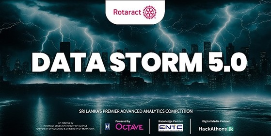

    

# Data Storm 5.0

Data Storm 5.0, Sri Lanka's leading Advanced Analytics Competition, is driven by OCTAVE, the John Keells Group Data and Advanced Analytics Center of Excellence, serving as the official sponsor for the fifth consecutive year.

Data Storm offers a prominent stage for tackling real-world challenges through cutting-edge technologies. It empowers university students to showcase their skills in delivering strategic and inventive solutions, fostering extensive learning experiences.

## Repository Overview

This repository is for maintaining our solutions for different rounds in this competition.

### Rounds

1. [Storming Round](/STORMING_ROUND)
